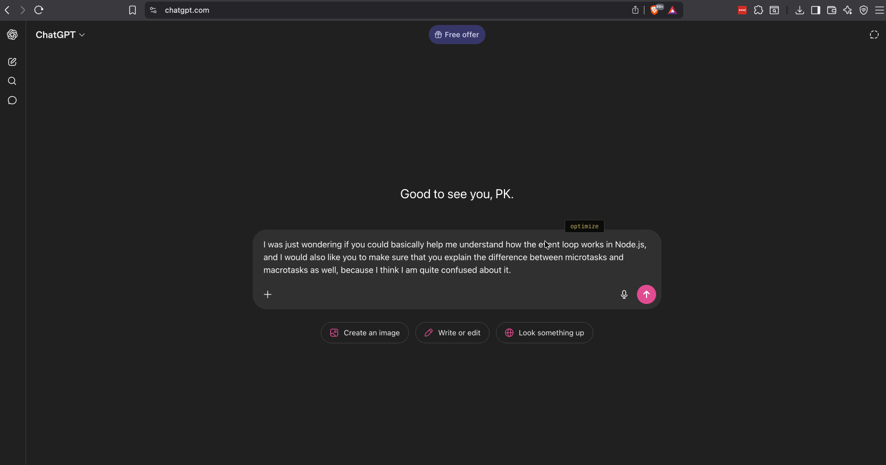
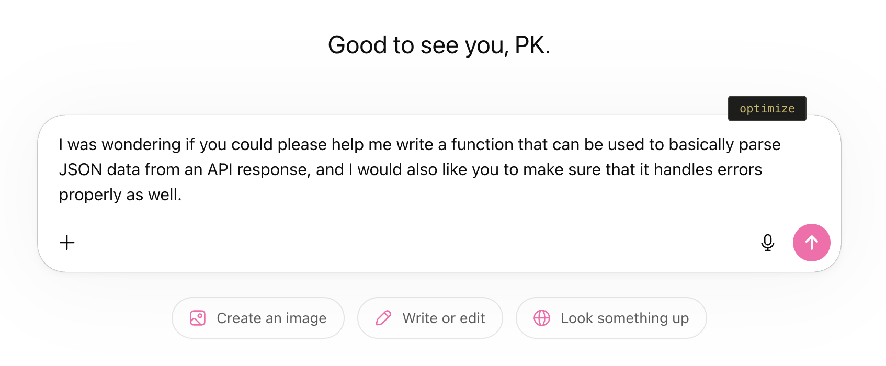
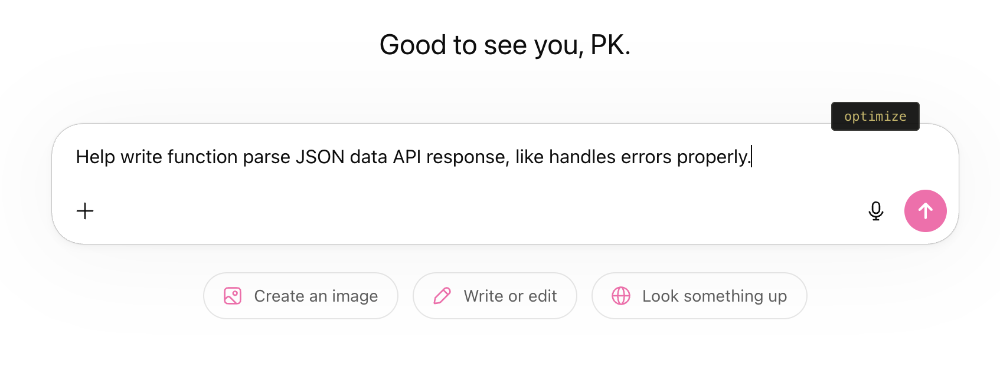
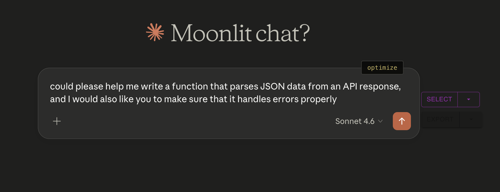
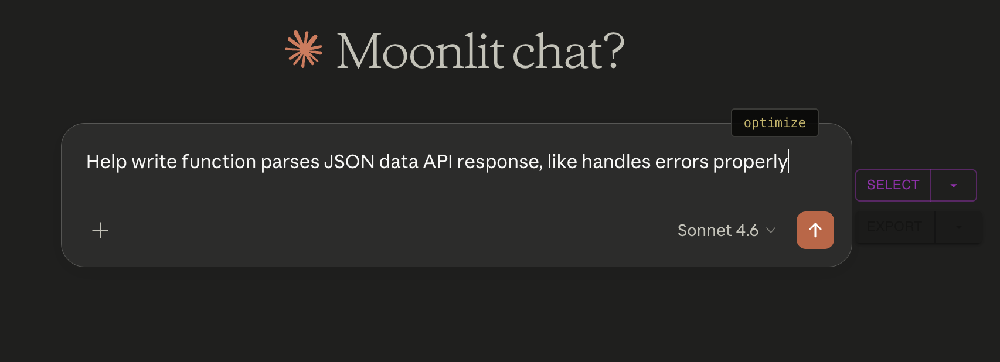
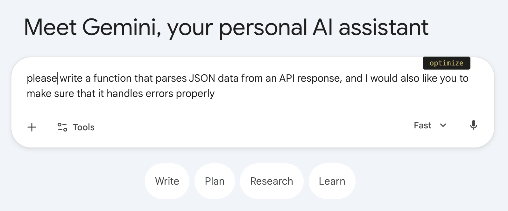
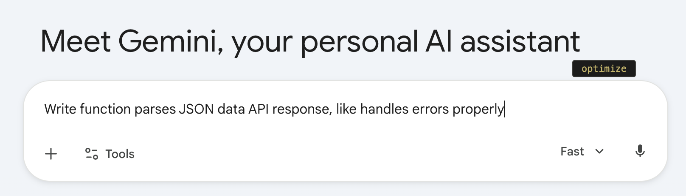

# Taar

> Telegraph-era Telegram discipline for AI prompts. Every token costs. Make them count.

Browser extension. No server. No API key.

## How it works

Click into any prompt box on Claude, ChatGPT, Gemini — an `optimize` button appears. Click it. Fillers stripped, stop words dropped, signal preserved.

**Before:**
> I was wondering if you could please help me write a function that can be used to basically parse JSON data from an API response, and I would also like you to make sure that it handles errors properly as well.

**After:**
> Write function parse JSON data API response, handle errors.

Same intent. Fewer tokens. Lower cost.

## In Action

> ⚠️ **When to not use Taar**
> - Code or technical prompts — stop words will mangle syntax
> - When exact phrasing matters — context, nuance, tone
> - Already concise prompts — it will over-strip

**Mistaken optimize?** `CtrlorCmd+Z` restores original.

## Why

- The telegram was the original token economy transmitted by Telegraph. Operators charged per word. Every sender became an editor — cutting adjectives, dropping pleasantries, keeping only what the receiver needed to act.
- Your LLM reads the same way. It doesn't need the preamble. It doesn't need _in, on, at, of, i was wondering, please, like_  It needs the instruction.
- Taar is that editor. Local, fast.

## Screenshots

**ChatGPT**

**Claude**

**Gemini**

**Mistral**

## License

MIT